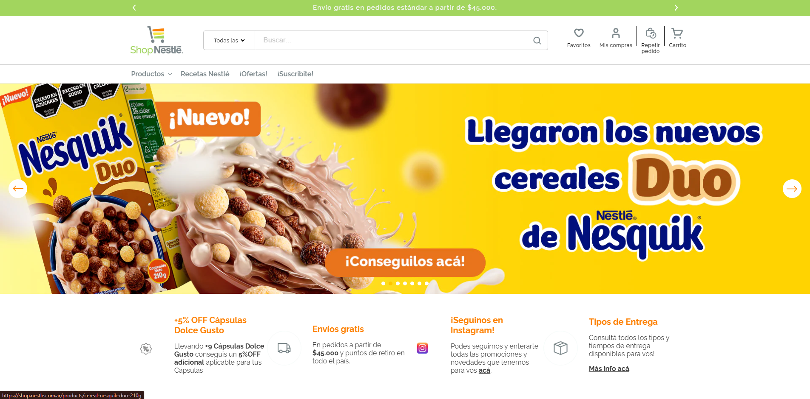

# Shop Nestlé - Shopify Theme

A modern, responsive Shopify theme for [Shop Nestlé Argentina](https://shop.nestle.com.ar/), featuring a clean design optimized for e-commerce with comprehensive product catalog management, cart functionality, and customer account features.



## 🌐 Live Site

Visit the live website: **[https://shop.nestle.com.ar/](https://shop.nestle.com.ar/)**

## ✨ Features

- **Product Catalog**: Comprehensive product browsing with categories including:
  - Bebes y Niños (Babies and Children)
  - Café (Coffee)
  - Cereales (Cereals)
  - Chocolates
  - Productos Culinarios (Culinary Products)
  - NESCAFÉ Dolce Gusto
  - Lácteos (Dairy Products)
  - Nesquik
  - Suplementos Nutricionales (Nutritional Supplements)

- **Shopping Features**:
  - Shopping cart with drawer functionality
  - Quick add to cart
  - Product variant picker
  - Quantity popover
  - Wishlist/Favorites
  - Repeat order functionality
  - Free shipping on orders over $45,000 ARS

- **User Experience**:
  - Responsive design for all devices
  - Predictive search
  - Product filtering and faceting
  - Customer account management
  - Order history
  - Address management
  - Newsletter subscription

- **Special Features**:
  - Product model viewer (3D/AR)
  - Video sections
  - Image galleries with zoom
  - Blog integration
  - Recipe section
  - Promotional banners and offers
  - Instagram integration

## 🛠️ Technologies

- **Platform**: Shopify
- **Theme Base**: Dawn 15.0.0
- **Languages**:
  - Liquid (Shopify's templating language)
  - JavaScript (ES6+)
  - CSS3
- **Key Libraries & Features**:
  - Shopify Theme API
  - Cart API
  - Product API
  - Customer API

## 📁 Project Structure

```
shopify-clothes/
├── assets/              # CSS, JavaScript, and image files
│   ├── *.css           # Component and section styles
│   ├── *.js            # JavaScript functionality
│   └── Home.png        # Homepage screenshot
├── config/             # Theme configuration
│   ├── settings_data.json
│   └── settings_schema.json
├── layout/             # Theme layouts
│   ├── theme.liquid    # Main theme layout
│   └── password.liquid # Password page layout
├── locales/            # Translation files (52 languages)
├── sections/           # Reusable page sections (57 files)
├── snippets/           # Reusable code snippets (76 files)
└── templates/          # Page templates
    ├── index.json      # Homepage
    ├── product.json    # Product pages
    ├── collection.json # Collection pages
    ├── cart.json       # Cart page
    └── customers/      # Customer account pages
```

## 🚀 Getting Started

### Prerequisites

- A Shopify store (development or production)
- Shopify CLI installed
- Node.js (for local development)

### Installation

1. **Clone the repository**:
   ```bash
   git clone <repository-url>
   cd shopify-clothes
   ```

2. **Login to Shopify CLI**:
   ```bash
   shopify login
   ```

3. **Connect to your store**:
   ```bash
   shopify theme dev
   ```

4. **Or push to a development theme**:
   ```bash
   shopify theme push --unpublished
   ```

### Development

- **Start local development server**:
  ```bash
  shopify theme dev
  ```
  This will start a local server and provide a preview URL.

- **Pull theme from Shopify**:
  ```bash
  shopify theme pull
  ```

- **Push changes to Shopify**:
  ```bash
  shopify theme push
  ```

## 📝 Key Components

### Cart System
- `cart.js` - Main cart functionality
- `cart-drawer.js` - Drawer cart component
- `cart-notification.js` - Add to cart notifications

### Product Features
- `product-form.js` - Product form handling
- `product-info.js` - Product information display
- `product-variant-picker.js` - Variant selection
- `quick-add.js` - Quick add to cart

### Search & Navigation
- `predictive-search.js` - Search suggestions
- `main-search.js` - Main search functionality
- `facets.js` - Product filtering

### Customer Features
- `customer.js` - Customer account management
- Customer templates in `templates/customers/`

## 🎨 Customization

The theme uses Shopify's theme editor for easy customization. Key customizable areas include:

- Logo and branding
- Colors and typography
- Product page layouts
- Collection page layouts
- Footer content
- Navigation menus

## 📦 Sections Available

The theme includes 57+ sections for flexible page building:
- Featured products
- Image banners
- Rich text
- Newsletter signup
- Blog posts
- Multi-column layouts
- Video sections
- And many more...

## 🌍 Localization

The theme supports 52 languages with translation files in the `locales/` directory, making it suitable for international markets.

## 📄 License

This is a custom Shopify theme for Shop Nestlé Argentina. All rights reserved.

## 🤝 Contributing

This is a private project for Shop Nestlé. For contributions or issues, please contact the development team.

## 📞 Support

For support or questions about the theme:
- Visit the [Shop Nestlé website](https://shop.nestle.com.ar/)
- Contact Nestlé Argentina support

---

**Designed & Developed by INNOVATE GROUP | SHOPIFY EXPERTS**

© 2025, Shop Nestlé - TODOS LOS DERECHOS RESERVADOS.

